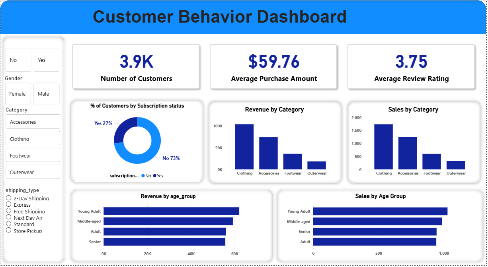

# 🛒 Customer Shopping Behavior Analysis

## 🎯 Business Problem Statement
In the competitive retail landscape, understanding customer purchasing behavior is crucial for driving sales and fostering long-term loyalty. The objective of this project is to analyze customer demographic data, purchasing patterns, and subscription behaviors to provide actionable business insights. These insights aim to help stakeholders optimize targeted marketing campaigns, improve inventory management, and boost subscription conversion rates.

## 🛠️ Tech Stack & Tools
* **Python (Pandas):** Handled missing values (imputed review ratings using category medians), performed data cleaning, and engineered new features (e.g., `age_group` categorization and purchase frequency mapping).
* **PostgreSQL:** Built a secure database environment using `SQLAlchemy` and `psycopg2` to load cleaned data. Executed complex SQL queries involving CTEs, Window Functions, and aggregations for deep dive analysis.
* **Power BI:** Designed a dynamic, corporate-themed interactive dashboard highlighting Key Performance Indicators (KPIs) and business metrics.

## 🔄 Project Workflow
1. **Data Preprocessing Pipeline:** Raw CSV data was cleaned and transformed using Python. 
2. **Database Integration:** The cleaned dataframe was directly pushed to a PostgreSQL database via Python scripts.
3. **Exploratory Data Analysis (SQL):** Extracted strategic metrics such as top-performing categories, repeat buyer habits, and revenue splits.
4. **Data Visualization:** Built an aesthetic and functional Power BI dashboard to present the findings to non-technical stakeholders visually.

## 💡 Key Business Insights & Recommendations

1. **The Subscription Gap (High Priority):** 
   * **Insight:** Approximately **73%** of the customer base (2,847 out of 3,900) is unsubscribed, yet their average spend ($59.86) is almost identical to subscribed customers ($59.49).
   * **Action:** Launch a targeted membership drive for repeat non-subscribed buyers to convert them into long-term loyal customers.

2. **Demographic Dominance (Gender & Age):**
   * **Insight:** Male customers generate significantly more revenue (**$157,890**) compared to female customers (**$75,191**). Additionally, **Young Adults** are the highest-spending age group (**$62,143**).
   * **Action:** Reallocate marketing budget towards youth-centric platforms and create specialized campaigns focusing on male fashion/accessories, while investigating the drop-off in the female segment.

3. **Top Performing Categories:**
   * **Insight:** **Clothing** is the ultimate revenue driver, generating **$104,264** in sales, maintaining a massive lead over Accessories ($74,200), Footwear, and Outerwear.
   * **Action:** Optimize inventory to ensure top-selling clothing items are never out of stock and consider bundling outerwear with clothing to boost its sales.

4. **Shipping & Purchase Value:**
   * **Insight:** Customers utilizing 'Express' shipping have a higher average purchase amount (**$60.48**) compared to those using 'Standard' shipping (**$58.46**).
   * **Action:** Promote 'Express' shipping at checkout or offer it for free on orders above a certain threshold (e.g., $70) to encourage higher cart values.

## 📂 Repository Structure
* `Data/`: Contains the raw and cleaned `.csv` datasets.
* `Notebooks/`: Contains the Jupyter Notebook (`.ipynb`) used for data cleaning and EDA.
* `SQL_Scripts/`: Contains the `.sql` file with advanced queries used for data extraction.
* `Dashboard/`: Contains the Power BI file (`.pbix`) and the final dashboard screenshot.

## 📈 Dashboard Preview

---
*This project demonstrates a complete end-to-end data analytics pipeline, transforming raw data into strategic business intelligence.*
